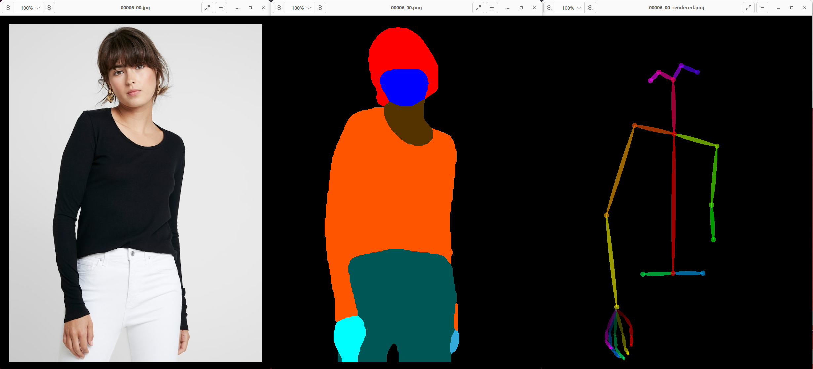
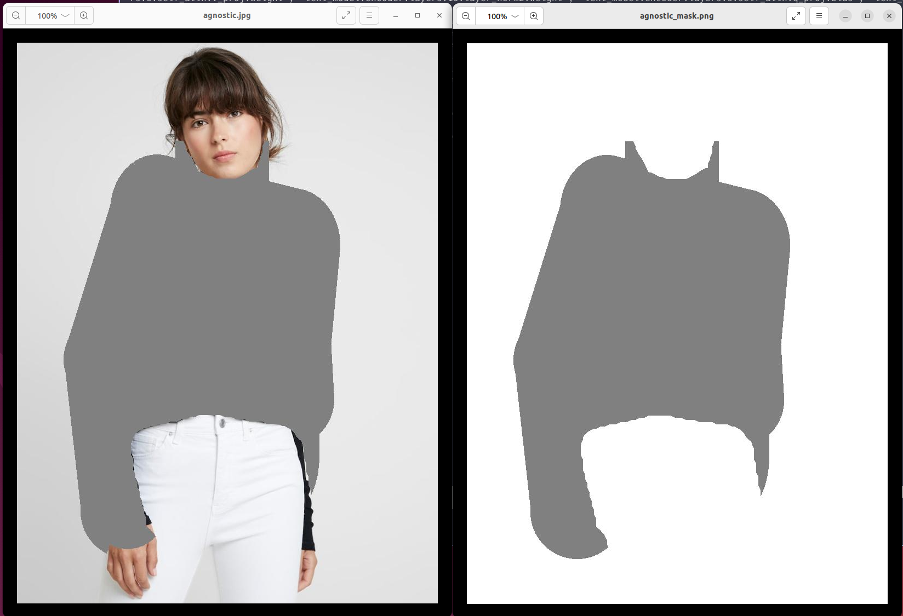
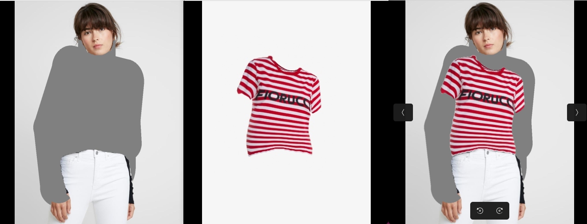
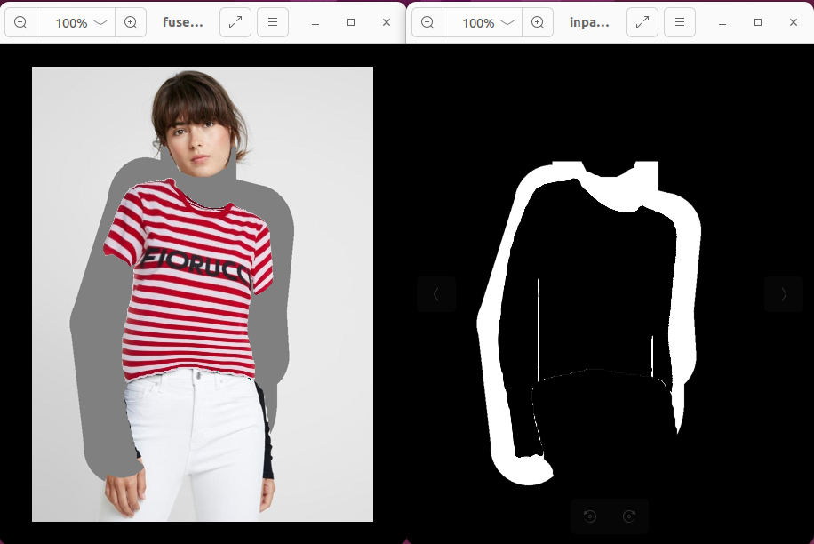

# Data processing for Virtual Try-On projects

针对Virtual try-on任务可能需要的一些数据预处理

相关任务：HR-VITON **Issue** [#45](https://github.com/sangyun884/HR-VITON/issues/45) (OpenPose、Human Parse、DensePose、Cloth Mask、Parse Agnostic、Human Agnostic)

## 1、agnostic/agnostic-mask

## 2、agnostic + warped_cloth merge

## 3、inpaint_mask

